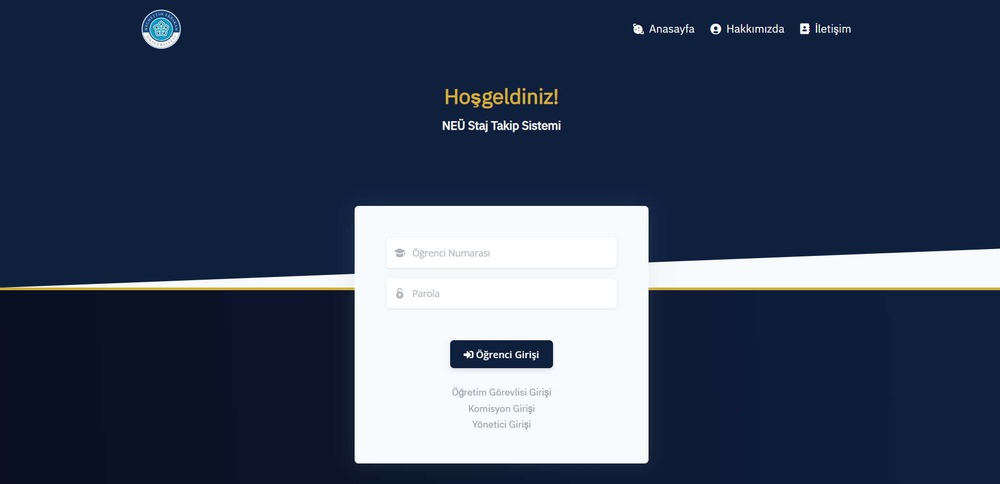
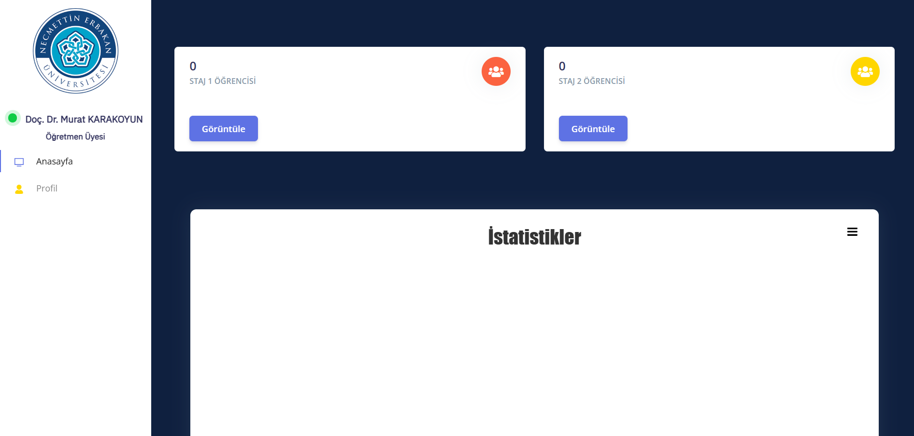

# Staj Takip Sitesi - Web Geliştirme Dersi Final Projesi

Bu proje, öğrencilerin staj süreçlerini yönetmek, takip etmek ve değerlendirmek amacıyla geliştirilmiş bir web tabanlı staj takip sistemidir. Sistem, farklı kullanıcı rolleri (Admin, Komisyon, Öğretmen ve Öğrenci) için özelleştirilmiş arayüzler ve işlevler sunar.

## Özellikler

- **Kullanıcı Rolleri:**
    - **Admin:** Sistemin genel yöneticisidir. Kullanıcı hesaplarını (admin, komisyon, öğretmen, öğrenci) yönetebilir, sistem ayarlarını yapabilir ve genel istatistikleri görüntüleyebilir.
    - **Komisyon:** Staj komisyonu üyeleri için tasarlanmıştır. Staj başvurularını inceleyebilir, onaylayabilir veya reddedebilir. Ayrıca, staj duyuruları yayınlayabilirler.
    - **Öğretmen:** Öğrencilerin staj süreçlerini takip eder, staj defterlerini ve raporlarını inceler ve değerlendirme yapar.
    - **Öğrenci:** Staj başvurusu yapabilir, başvuru durumunu takip edebilir, staj belgelerini (rapor, defter vb.) sisteme yükleyebilir ve duyuruları görüntüleyebilir.

- **Modüller:**
    - **Kullanıcı Yönetimi:** Admin tarafından yeni kullanıcı ekleme, mevcut kullanıcı bilgilerini düzenleme ve silme işlemleri.
    - **Staj Başvuru Sistemi:** Öğrencilerin online olarak staj başvurusu yapabilmesi ve komisyonun bu başvuruları yönetebilmesi.
    - **Belge Yükleme:** Öğrencilerin stajla ilgili gerekli belgeleri sisteme yükleyebilmesi.
    - **Değerlendirme ve Notlandırma:** Öğretmenlerin, öğrencilerin staj performanslarını ve belgelerini değerlendirerek not vermesi.
    - **Duyuru Sistemi:** Komisyon tarafından öğrencilere ve öğretmenlere yönelik genel duyuruların yayınlanması.
    - **Profil Yönetimi:** Tüm kullanıcıların kendi profil bilgilerini güncelleyebilmesi.

## Ekran Görüntüleri

### Giriş Ekranı


### Admin Paneli
.png)
.png)
.png)

### Komisyon Paneli
.png)
.png)
.png)
.png)
.png)

### Öğrenci Paneli
.png)
.png)
.png)
.png)
.png)
.png)
.png)
.png)

### Öğretmen Paneli


## Kurulum

Projeyi yerel makinenizde çalıştırmak için aşağıdaki adımları izleyin:

### Gereksinimler

-   [XAMPP](https://www.apachefriends.org/tr/index.html) veya benzeri bir yerel sunucu yazılımı (Apache, MySQL, PHP içeren).
-   Bir metin editörü (örn: VS Code, Sublime Text).
-   Bir web tarayıcısı (örn: Chrome, Firefox).

### Adımlar

1.  **Projeyi Klonlayın veya İndirin:**
    ```bash
    git clone <proje_repository_linki>
    ```
    veya projeyi ZIP olarak indirip bir klasöre çıkartın.

2.  **Proje Dosyalarını Sunucuya Taşıyın:**
    -   Proje klasörünü XAMPP'nin `htdocs` dizinine (`C:/xampp/htdocs/`) kopyalayın.

3.  **Veritabanını Oluşturun ve İçeri Aktarın:**
    -   XAMPP kontrol panelinden Apache ve MySQL modüllerini başlatın.
    -   Tarayıcınızdan `http://localhost/phpmyadmin` adresine gidin.
    -   Yeni bir veritabanı oluşturun. Veritabanı adı olarak `yazgeldb` kullanabilirsiniz.
    -   Oluşturduğunuz veritabanını seçin ve üst menüden "İçe Aktar" (Import) sekmesine tıklayın.
    -   Proje dosyaları içinde bulunan `yazgeldb.sql` dosyasını seçin ve içe aktarma işlemini başlatın.

4.  **Veritabanı Bağlantı Ayarları:**
    -   Projenin veritabanı bağlantı ayarlarının yapıldığı dosyayı bulun. Bu dosya genellikle `config`, `db` veya `Backend` gibi bir klasörde bulunur. Proje yapısına göre `Admin/dashboard/Backend/DB/db.php` veya benzeri dosyalarda olabilir.
    -   Dosya içeriğini açarak aşağıdaki değişkenleri kendi veritabanı bilgilerinizle güncelleyin:
        ```php
        <?php
        $servername = "localhost";
        $username = "root"; // MySQL kullanıcı adınız
        $password = ""; // MySQL şifreniz (XAMPP'de varsayılan olarak boştur)
        $dbname = "yazgeldb"; // Oluşturduğunuz veritabanının adı

        // Bağlantı oluşturma
        $conn = new mysqli($servername, $username, $password, $dbname);

        // Bağlantıyı kontrol etme
        if ($conn->connect_error) {
            die("Bağlantı hatası: " . $conn->connect_error);
        }
        ?>
        ```

5.  **Projeyi Çalıştırın:**
    -   Tarayıcınızın adres çubuğuna `http://localhost/proje_klasor_adi/` yazarak projeye erişebilirsiniz.

## Nasıl Kullanılır?

### Giriş Sayfaları

-   **Admin Girişi:** `admin_login.php`
-   **Komisyon Girişi:** `commission_login.php`
-   **Öğretmen Girişi:** `teacher_login.php`
-   **Öğrenci Girişi:** (Ana sayfada veya `student_login.php` benzeri bir dosyada yer alır)

### Örnek Kullanım Senaryoları

#### Yeni Bir Öğrenci Ekleme (Admin)

1.  Admin olarak sisteme giriş yapın.
2.  Sol menüden veya kontrol panelinden "Kullanıcı Ekle" veya benzeri bir seçeneğe gidin.
3.  "Öğrenci Ekle" formunu seçin.
4.  Öğrencinin bilgilerini (adı, soyadı, numarası, şifre vb.) eksiksiz bir şekilde doldurun.
5.  "Ekle" butonuna basarak işlemi tamamlayın.

#### Staj Başvurusu Yapma (Öğrenci)

1.  Öğrenci olarak sisteme giriş yapın.
2.  Kontrol panelinden "Staj Başvurusu Yap" veya "Yeni Başvuru" menüsüne tıklayın.
3.  Başvuru formunda istenen bilgileri (şirket bilgileri, staj tarihleri vb.) doldurun.
4.  Gerekli belgeleri (başvuru formu, sigorta belgesi vb.) yükleyin.
5.  Başvuruyu gönderin. Başvuru durumunuzu "Başvurularım" sayfasından takip edebilirsiniz.

#### Staj Başvurusunu Değerlendirme (Komisyon)

1.  Komisyon üyesi olarak sisteme giriş yapın.
2.  "Staj Başvuruları" veya "Bekleyen Başvurular" listesine gidin.
3.  İncelemek istediğiniz öğrencinin başvurusuna tıklayın.
4.  Başvuru bilgilerini ve belgelerini kontrol edin.
5.  "Onayla" veya "Reddet" seçeneklerinden birini kullanarak başvuruyu sonuçlandırın.

## Proje Dosya Yapısı

Proje, ana dizinde bulunan giriş sayfaları ve her bir kullanıcı rolü için ayrılmış klasörlerden oluşur:

```
/
├── admin_login.php
├── commission_login.php
├── teacher_login.php
├── index.php (Ana sayfa ve öğrenci girişi)
├── yazgeldb.sql (Veritabanı yedeği)
|
├── Admin/
│   └── dashboard/ (Admin paneli dosyaları)
|
├── Commission/
│   └── dashboard/ (Komisyon paneli dosyaları)
|
├── Student/
│   └── dashboard/ (Öğrenci paneli dosyaları)
|
├── Teacher/
│   └── dashboard/ (Öğretmen paneli dosyaları)
|
├── assets/ (CSS, JS, resimler gibi genel statik dosyalar)
└── process/ (Giriş işlemleri gibi arka plan PHP kodları)
```

## Katkıda Bulunma

Projeye katkıda bulunmak isterseniz, lütfen aşağıdaki adımları izleyin:

1.  Bu projeyi "fork"layın.
2.  Kendi özelliğiniz için yeni bir "branch" oluşturun (`git checkout -b ozellik/yeni-ozellik`).
3.  Değişikliklerinizi "commit" edin (`git commit -am 'Yeni bir özellik eklendi'`).
4.  Oluşturduğunuz branch'i "push"layın (`git push origin ozellik/yeni-ozellik`).
5.  Bir "pull request" (çekme isteği) oluşturun.
